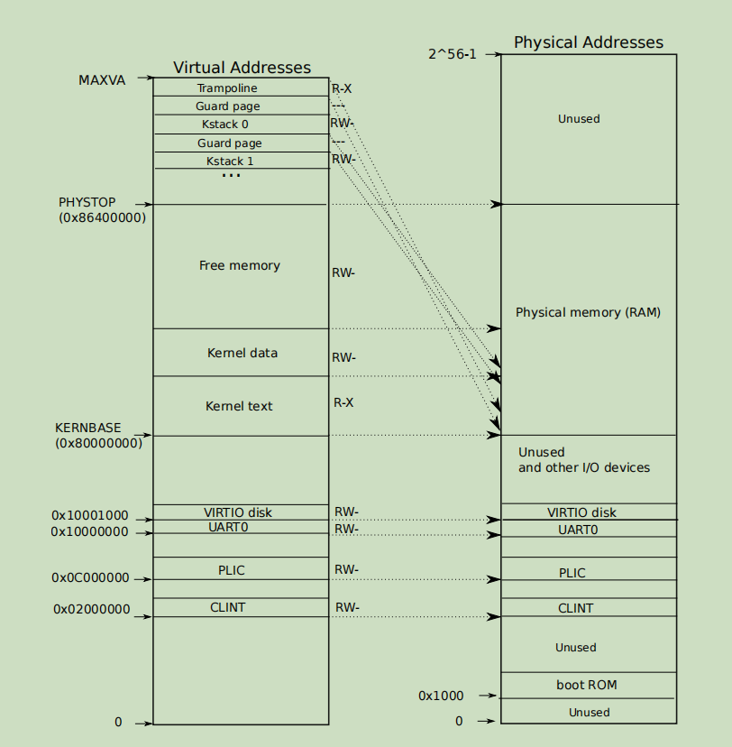
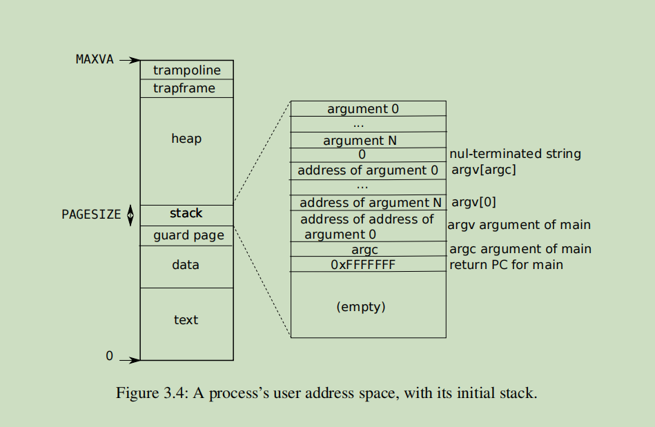

# Simplify copyin/copyinstr

简化copyin/copyinstr

#### 原理

两个函数用于将用户空间的虚拟地址为srcva的内存拷贝到内核空间地址为dst的内存中。

原来的这两个函数，通过用户空间页表查找到srcva的物理地址，再传给内核空间，然后再进行拷贝。Simplify需要将用户页表拷贝到内核页表，这样在内核空间使用进行上述拷贝时可以直接查询内核页表然后进行拷贝,并且能使用到TLB。

根据提示，只需在fork(),exec(),sbrk()中同步用户页表到内核页表。思考了下原因：fork(),exec()显然不用说，sbrk()更改用户空间大小，自然也是修改了用户页表，但是为什么不用在用于创建进程的allocproc中也同步呢？因为allocproc中声明的时一个空的用户页表，在后面进程运行时自然避免不了调用sbrk()增加用户空间，也就在sbrk中同步了用户页表和内核页表。

根据内核空间和用户空间结构，可直接将用户空间复制到内核空间低段未使用空间(0\~0x2000000，可扩展到0x0c000000，因为client只用于系统启动)。同时用户空间不能过大否则无法全部映射。

<figure><figcaption>
内核地址空间
</figcaption></figure>

<figure><figcaption>
用户地址空间
</figcaption></figure>
