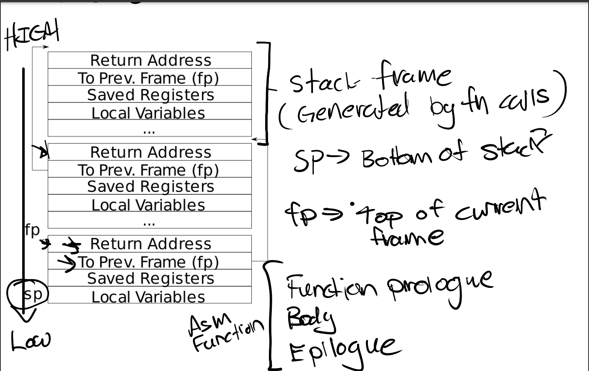

# Backtrace

<figure><figcaption>
stack frame
</figcaption></figure>

根据栈帧结构，所有栈帧通过To Prev.Frame(fp)联系起来，调用r\_fp()获取最近一次的栈帧地址，之后遍历所有的栈帧并输出 Return Address即可。

栈帧存在kstack中，通过判断（PGROUNDUP(fp) >= myproc()->kstack）即可知道是否遍历结束。
